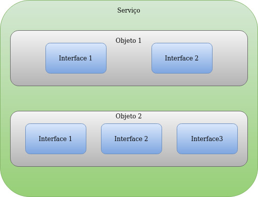
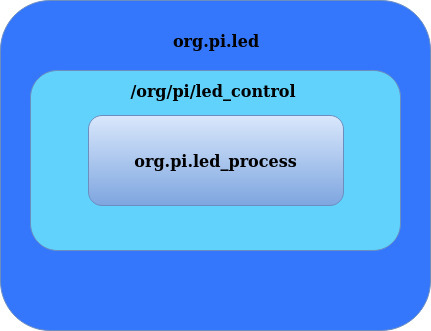

<p align="center">
  
</p>

# _DBUS_

## Tópicos
* [Introdução](#introdução)
* [Implementação](#implementação)
* [launch_processes](#launch_processes)
* [button_interface](#button_interface)
* [led_interface](#led_interface)
* [Compilando, Executando e Matando os processos](#compilando-executando-e-matando-os-processos)
* [Compilando](#compilando)
* [Clonando o projeto](#clonando-o-projeto)
* [Selecionando o modo](#selecionando-o-modo)
* [Modo PC](#modo-pc)
* [Modo RASPBERRY](#modo-raspberry)
* [Executando](#executando)
* [Interagindo com o exemplo](#interagindo-com-o-exemplo)
* [MODO PC](#modo-pc-1)
* [MODO RASPBERRY](#modo-raspberry-1)
* [Matando os processos](#matando-os-processos)
* [Conclusão](#conclusão)
* [Referência](#referência)

## Introdução
O D-Bus foi criado em 2002 e faz parte do projeto freedesktop.org, é mantido pela RedHat e pela comunidade. D-Bus é um IPC projetado com o objetivo de servir como camada intermediária(middleware) para ambientes desktop. Um projeto conhecido como GNOME faz uso desse mecanismo. D-Bus diferente de outros mecanismos como shared memory, queues e sockets carece de recursos, o que o torna rápido e simples. D-Bus não é um substituto para os outros IPC, cada IPC tem um propósito. 

## D-Bus
O conceito principal no D-Bus é o barramento. Através do canal é possível chamadas de métodos, enviar sinais e escutar sinais. Existe dois tipos de barramento: o barramento de sessão e o barramento de sistema.
* Session Bus - é usado para a comunicação de aplicações que são conectadas em uma mesma sessão desktop.
* System Bus - é usado quando aplicações rodando em sessões separadas que precisam se comunicar entre si.

Um barramento D-Bus no sistema está na forma de bus daemon, que é um processo especializado em repassar as mensagens de um processo para o outro.

O D-Bus trabalha com diversos elementos sendo: Serviços, Objetos, Interfaces e Clientes, a seguir é apresentado as definições de cada elemento:
* Serviços - Um serviço é uma coleção de **Objetos** que fornece algum recurso, sendo apresentado no formato *well-know name* que facilita a leitura
* Objetos - Objetos são parte de um serviço, podem ser criados e removidos dinamicamente. Para acessar um objeto é usado o formato object path que é idêntico ao caminho de diretorio */org/servico/alguma_coisa*. Objetos podem implementar uma ou mais interfaces.
* Interfaces - São as implementações, os métodos, sinais e propriedades

Para demonstrar o relacionamento entre esse elementos segue uma imagem:

<p align="center">
  
</p>

## Permissões 
Para poder ter acesso ao barramento é necessário registrar e conceder permissão para quem vai utilizar os serviços. Esses arquivos são representados no formato XML e ficam nos diretórios /etc/dbus-1/system.d e /etc/dbus-1/session.d
Para exemplificar a implementação desses arquivos é apresentado o arquivo de configuração utilizado para o processo de botão
```bash
<!DOCTYPE busconfig PUBLIC
"-//freedesktop//DTD D-BUS Bus Configuration 1.0//EN"
"http://www.freedesktop.org/standards/dbus/1.0/busconfig.dtd">
<busconfig>

<policy user="root">
    <allow own="org.pi.button"/>
</policy>

<policy user="pi">
    <allow own = "org.pi.button"/>
</policy>

<policy context="default">
    <allow send_interface="org.pi.led_process"/>
    <allow send_destination="org.pi.led"/>
</policy>

</busconfig>
```

Nesse arquivo os usuários root e pi recebem a permissão de utilização desse serviço. Permite envio de dados para a interface org.pi.led_process que que tem como destino o serviço org.pi.led_process.

## Tools
Para auxiliar o desenvolvimento usando o D-Bus existem algumas ferramentas que permite enviar dados para o barramento e monitorá-lo, sendo elas dbus-send e dbus-monitor.

## API
A API referente ao dbus é extensa segue [link](https://dbus.freedesktop.org/doc/api/html/index.html) para consulta das funções utilizadas no exemplo

## Implementação

Para demonstrar o uso desse IPC, iremos utilizar o modelo Produtor/Consumidor, onde o processo Produtor(_button_process_) vai escrever seu estado no barramento, e o Consumidor(_led_process_) vai ler o estado do barramento e aplicar o estado para si. Aplicação é composta por três executáveis sendo eles:
* _launch_processes_ - é responsável por lançar os processos _button_process_ e _led_process_ através da combinação _fork_ e _exec_
* _button_interface_ - é responsável por ler o GPIO em modo de leitura da Raspberry Pi e escrever o estado no barramento
* _led_interface_ - é responsável por ler do barramento o estado do botão e aplicar em um GPIO configurado como saída

O diagrama para a aplicação de LED fica da seguinte forma:

<p align="center">
  
</p>

### *launch_processes.c*

No _main_ criamos duas variáveis para armazenar o PID do *button_process* e do *led_process*, e mais duas variáveis para armazenar o resultado caso o _exec_ venha a falhar.
```c
int pid_button, pid_led;
int button_status, led_status;
```

Em seguida criamos um processo clone, se processo clone for igual a 0, criamos um _array_ de *strings* com o nome do programa que será usado pelo _exec_, em caso o _exec_ retorne, o estado do retorno é capturado e será impresso no *stdout* e aborta a aplicação. Se o _exec_ for executado com sucesso o programa *button_process* será carregado. 
```c
pid_button = fork();

if(pid_button == 0)
{
    //start button process
    char *args[] = {"./button_process", NULL};
    button_status = execvp(args[0], args);
    printf("Error to start button process, status = %d\n", button_status);
    abort();
}   
```

O mesmo procedimento é repetido novamente, porém com a intenção de carregar o *led_process*.

```c
pid_led = fork();

if(pid_led == 0)
{
    //Start led process
    char *args[] = {"./led_process", NULL};
    led_status = execvp(args[0], args);
    printf("Error to start led process, status = %d\n", led_status);
    abort();
}
```

### *dbus_endpoint.h*
Aqui é definido os nomes dos componentes
```c
#define INTERFACE_NAME          "org.pi.led_process"
#define SERVER_BUS_NAME         "org.pi.led"
#define CLIENT_BUS_NAME         "org.pi.button"
#define SERVER_OBJECT_PATH_NAME "/org/pi/led_control"
#define CLIENT_OBJECT_PATH_NAME "/org/pi/button"
#define METHOD_NAME             "led_set"
```

### *button_interface.h*
Para usar a interface do botão precisa implementar essas duas callbacks para permitir o seu uso.
```c
typedef struct 
{
    bool (*Init)(void *object);
    bool (*Read)(void *object);
    
} Button_Interface;
```
A assinatura do uso da interface corresponde ao contexto do botão, que depende do modo selecionado e a interface do botão devidamente preenchida.
```c
bool Button_Run(void *object, Button_Interface *button);
```

### *button_interface.c*
Aqui é criado algumas variáveis, **conn** que representa o contexto no qual irá conter as informações sobre a conexão com o barramento, **dbus_error** que irá apresentar os resultados de algumas funções para poder ser apresentada, **state** que é o estado interno do botão e uma lista de comando que representa a mensagem a ser enviada. Logo em seguida é feita a inicialização do botão e do D-Bus, após a inicialização fica em um loop aguardando o pressionamento do botão para alterar o estado interno, requisita o barramento, requisita o serviço no qual quer enviar a mensagem, realiza o envio e libera os recursos, retornando ao início dessa forma aguardando um novo pressionamento.
```c
bool Button_Run(void *object, Button_Interface *button)
{
    DBusConnection *conn;
    DBusError dbus_error;
    int state = 0;
    const char *states[] = 
    {
        "ON",
        "OFF"
    };

    if(button->Init(object) == false)
        return false;

    conn = DBUS_Init(&dbus_error);
    if(!conn)
        return false;

    while(true)
    {
        wait_press(object, button);

        state ^= 0x01;

        DBUS_BUS_Request(conn, &dbus_error);

        DBusMessage *request = DBUS_Get_Message_Request();
        if(request == NULL)
            return false;
        
        DBUS_Send_Message(conn, request, states[state]);

        dbus_connection_flush(conn);
        dbus_message_unref(request);        

        if (dbus_bus_release_name(conn, CLIENT_BUS_NAME, &dbus_error) == -1)
            return false;
    }

    return false;
}
```

Apresenta qual o erro que ocorreu.
```c
static void print_dbus_error(DBusError *dbus_error, char *str)
{
    fprintf(stderr, "%s: %s\n", str, dbus_error->message);
    dbus_error_free(dbus_error);
}
```

Inicia o D-Bus em modo bus system.
```c
static DBusConnection *DBUS_Init(DBusError *dbus_error)
{
    DBusConnection *conn;

    dbus_error_init(dbus_error);

    conn = dbus_bus_get(DBUS_BUS_SYSTEM, dbus_error);

    if (dbus_error_is_set(dbus_error))
        print_dbus_error(dbus_error, "dbus_bus_get");

    return conn;
}
```
Requisita o serviço no qual quer se comunicar.
```c
static void DBUS_BUS_Request(DBusConnection *conn, DBusError *dbus_error)
{
    int ret;
    while (true)
    {
        ret = dbus_bus_request_name(conn, CLIENT_BUS_NAME, 0, dbus_error);

        if (ret == DBUS_REQUEST_NAME_REPLY_PRIMARY_OWNER)
            break;

        if (ret == DBUS_REQUEST_NAME_REPLY_IN_QUEUE)
        {
            sleep(1);
            continue;
        }
        if (dbus_error_is_set(dbus_error))
            print_dbus_error(dbus_error, "dbus_bus_get");
    }
}
```
Requisita o método no qual quer enviar a mensagem para um determinado objeto referente ao serviço.
```c
static DBusMessage *DBUS_Get_Message_Request(void)
{
    return dbus_message_new_method_call(SERVER_BUS_NAME, SERVER_OBJECT_PATH_NAME,
                                                    INTERFACE_NAME, METHOD_NAME);
}
```
Concatena a mensagem e envia para o serviço.
```c
static bool DBUS_Send_Message(DBusConnection *conn, DBusMessage *request, const char *message)
{
    DBusMessageIter iter;
    dbus_message_iter_init_append(request, &iter);

    if (!dbus_message_iter_append_basic(&iter, DBUS_TYPE_STRING, &message))
        return false;

    if (!dbus_connection_send(conn, request, NULL))
        return false;

    return true;
}
```

### *led_interface.h*
Para realizar o uso da interface de LED é necessário preencher os callbacks que serão utilizados pela implementação da interface, sendo a inicialização e a função que altera o estado do LED.
```c
typedef struct 
{
    bool (*Init)(void *object);
    bool (*Set)(void *object, uint8_t state);
} LED_Interface;
```
A assinatura do uso da interface corresponde ao contexto do LED, que depende do modo selecionado e a interface do LED devidamente preenchida.
```c
bool LED_Run(void *object, LED_Interface *led);
```

### *led_interface.c*
Aqui é criado algumas variáveis, **conn** que representa o contexto no qual irá conter as informações sobre a conexão com o barramento, **dbus_error** que irá apresentar os resultados de algumas funções para poder ser apresentada. Logo em seguida é feita a inicialização do LED e do D-Bus, após a inicialização requisita qual o serviço que vai se comunicar. No loop fica aguardando alguma mensagem chegar, caso sim verifica se é referente a interface e o método, recupera a mensagem aplica caso for reconhecida pela aplicação e libera os recursos.
```c
bool LED_Run(void *object, LED_Interface *led)
{
    DBusConnection *conn;
    DBusError dbus_error;

    if (led->Init(object) == false)
        return false;

    conn = DBUS_Init(&dbus_error);
    if(!conn)
        return false;

    if (DBUS_BUS_Request(conn, &dbus_error) == false)
        return false;

    while (true)
    {
        if (!dbus_connection_read_write_dispatch(conn, -1))
        {
           break;
        }

        DBusMessage *message;

        if ((message = dbus_connection_pop_message(conn)) == NULL)
            continue;

        if (dbus_message_is_method_call(message, INTERFACE_NAME, METHOD_NAME))
        {
            char *s;

            if (dbus_message_get_args(message, &dbus_error, DBUS_TYPE_STRING, &s, DBUS_TYPE_INVALID))
            {
                if(!strcmp(s, "ON"))
                {
                    led->Set(object, 1);
                }
                else if(!strcmp(s, "OFF"))
                {
                    led->Set(object, 0);
                }

                dbus_connection_flush(conn);                                          
            }
            else
            {
                print_dbus_error(&dbus_error, "Error getting message");
            }
            dbus_message_unref(message); 
        }
    }
    return false;
}
```
Apresenta qual o erro que ocorreu.
```c
static void print_dbus_error(DBusError *dbus_error, char *str)
{
    fprintf(stderr, "%s: %s\n", str, dbus_error->message);
    dbus_error_free(dbus_error);
}
```

Inicializa o D-Bus requisitando o modo bus system
```c
static DBusConnection *DBUS_Init(DBusError *dbus_error)
{
    DBusConnection *conn;

    dbus_error_init(dbus_error);

    conn = dbus_bus_get(DBUS_BUS_SYSTEM, dbus_error);

    if (dbus_error_is_set(dbus_error))
        print_dbus_error(dbus_error, "dbus_bus_get");

    return conn;
}
```

Requisita o serviço no qual quer se comunicar
```c
static bool DBUS_BUS_Request(DBusConnection *conn, DBusError *dbus_error)
{
    int ret;
    ret = dbus_bus_request_name(conn, SERVER_BUS_NAME, DBUS_NAME_FLAG_DO_NOT_QUEUE, dbus_error);    

    if (ret != DBUS_REQUEST_NAME_REPLY_PRIMARY_OWNER)
        return false;

    return true;
}
```

## Compilando, Executando e Matando os processos
Para compilar e testar o projeto é necessário instalar a biblioteca de [hardware](https://github.com/NakedSolidSnake/Raspberry_lib_hardware) necessária para resolver as dependências de configuração de GPIO da Raspberry Pi.

## Compilando
Para facilitar a execução do exemplo, o exemplo proposto foi criado baseado em uma interface, onde é possível selecionar se usará o hardware da Raspberry Pi 3, ou se a interação com o exemplo vai ser através de input feito por FIFO e o output visualizado através de LOG.

### Clonando o projeto
Pra obter uma cópia do projeto execute os comandos a seguir:

```bash
$ git clone https://github.com/NakedSolidSnake/Raspberry_IPC_DBUS
$ cd Raspberry_IPC_DBUS
$ mkdir build && cd build
```

### Selecionando o modo
Para selecionar o modo devemos passar para o cmake uma variável de ambiente chamada de ARCH, e pode-se passar os seguintes valores, PC ou RASPBERRY, para o caso de PC o exemplo terá sua interface preenchida com os sources presentes na pasta src/platform/pc, que permite a interação com o exemplo através de FIFO e LOG, caso seja RASPBERRY usará os GPIO's descritos no [artigo](https://github.com/NakedSolidSnake/Raspberry_lib_hardware#testando-a-instala%C3%A7%C3%A3o-e-as-conex%C3%B5es-de-hardware).

#### Modo PC
```bash
$ cmake -DARCH=PC ..
$ make
```

#### Modo RASPBERRY
```bash
$ cmake -DARCH=RASPBERRY ..
$ make
```
#### Instalando os arquivos de configurações do D-Bus
Após a compilação do projeto para que os arquivos sejam instalados no diretório pertinente as permissões de uso do D-Bus basta executar:
```bash
$ sudo make install
```

Após a instalação é importante verificar se os arquivos de fato constam no diretório
```bash
$ ls /etc/dbus-1/system.d | grep solid
```
Output
```bash
org.solid.button.conf
org.solid.led.conf
```

## Executando
Para executar a aplicação execute o processo _*launch_processes*_ para lançar os processos *button_process* e *led_process* que foram determinados de acordo com o modo selecionado.

```bash
$ cd bin
$ sudo ./launch_processes
```

Uma vez executado podemos verificar se os processos estão rodando através do comando: 
```bash
$ ps -ef | grep _process
```

O output 
```bash
root     14705  2417  0 jul28 pts/3    00:00:00 ./button_process
root     14706  2417  0 jul28 pts/3    00:00:00 ./led_process
```
## Interagindo com o exemplo
Dependendo do modo de compilação selecionado a interação com o exemplo acontece de forma diferente

### MODO PC
Para o modo PC, precisamos abrir um terminal e monitorar os LOG's
```bash
$ sudo tail -f /var/log/syslog | grep LED
```

Dessa forma o terminal irá apresentar somente os LOG's referente ao exemplo.

Para simular o botão, o processo em modo PC cria uma FIFO para permitir enviar comandos para a aplicação, dessa forma todas às vezes que for enviado o número 0 irá logar no terminal onde foi configurado para o monitoramento, segue o exemplo
```bash
$ sudo su
# echo '0' > /tmp/dbus_file
```

Output do LOG quando enviado o comando algumas vezez
```bash
Jul 28 09:05:02 dell-cssouza LED DBUS[14706]: LED Status: Off
Jul 28 09:05:04 dell-cssouza LED DBUS[14706]: LED Status: On
Jul 28 09:05:04 dell-cssouza LED DBUS[14706]: LED Status: Off
Jul 28 09:05:05 dell-cssouza LED DBUS[14706]: LED Status: On
```

### MODO RASPBERRY
Para o modo RASPBERRY a cada vez que o botão for pressionado irá alternar o estado do LED.

## Monitorando 
Para monitorar a interface que foi implementada é usada a ferramenta dbus-monitor. Com essa ferramente é possível ver os dados que trafegam nesse barramento. Para monitorar uma interface específica é possível filtrar passando o argumento interface com a interface desejada. No exemplo fica assim:

```bash
sudo dbus-monitor --system type=signal interface=org.pi.led_process 
```

Para saber mais sobre a ferramenta use o man pages
```bash
$ man dbus-monitor
```
## Enviando comandos usando o dbus-send
Para poder enviar dados para o barramento é possível fazer uso da ferramenta dbus-send

```bash
$ dbus-send --system --print-reply --reply-timeout=[ms] --dest=[service] [object] [interface].[method] <type:data>
```

Para enviar comandos para o barramento é necessário ter a permissão de acesso,para este exemplo será usado o usuário root

```bash
sudo su
```

Então o comando fica da seguinte forma
```bash
$ dbus-send --system --print-reply --reply-timeout=1 --dest=org.pi.led /org/pi/led_control org.pi.led_process.led_set string:"OFF"
```

Nesse ponto vai gerar um erro devido a aplicação não responder. Com o monitoramento ligado é possível ver a seguinte saída:

Output
```bash
method call time=1627546830.262349 sender=:1.802 -> destination=org.pi.led serial=2 path=/org/pi/led_control; interface=org.pi.led_process; member=led_set
   string "OFF"
```

Existe uma ferramenta gráfica conhecida como d-feet verifique as referências para saber mais.

Para saber mais sobre a ferramenta use o man pages
```bash
$ man dbus-send
```
## Matando os processos
Para matar os processos criados execute o script kill_process.sh
```bash
$ cd bin
$ ./kill_process.sh
```

## Conclusão
D-Bus é uma forma de comunicação entre processos muito versátil, pois garante a implementação de forma desacoplada entre os processos. Projetos como KDE, Gnome, Systemd, Bluez, Network-manager fazem uso desse IPC. Garante segurança no uso desses serviços através de permissões, ou seja, não basta somente saber da existência serviço, mas também deve-se ter a permissão de poder usá-lo. A desvantagem que dbus possui é não poder realizar comunicação entre nodes, dessa forma caracteriza que cada forma de IPC possui sua área de atuação.

## Agradecimentos
Bom chegamos ao fim de uma série tão extensa e cheia de conteúdo e exemplos práticos. Espero que tenham gostado e quero deixar os meus agradecimentos pelo apoio e feedback recebido durante essa jornada.
Gostaria de agradecer ao Embarcados por permitir nós conceder essa gama de experiência compartilhada pelos nossos colegas. Gostaria de agradecer ao [Fábio Souza](https://www.embarcados.com.br/autor/fabio-souza/) pelo primeiro contato quando ainda estava receoso sobre como meus artigos seriam recepcionados. Obrigado Fábio pela força. Ao [Thiago Lima](https://www.embarcados.com.br/autor/thiagolima/) pela forma que apresentou e recomendou meus artigos, meu muito obrigado. Ao [Augusto](https://www.linkedin.com/in/augusto-vieira-b38289145/) que meu ajudou testando todos os exemplos e atuando como revisor final. E em especial a comunidade de receber os meus estudos de forma tão positiva, isso só me incentiva a continuar escrevendo. Obrigado a todos.

## Referência
* [Link do projeto completo](https://github.com/NakedSolidSnake/Raspberry_IPC_DBUS)
* [Mark Mitchell, Jeffrey Oldham, and Alex Samuel - Advanced Linux Programming](https://www.amazon.com.br/Advanced-Linux-Programming-CodeSourcery-LLC/dp/0735710430)
* [fork, exec e daemon](https://github.com/NakedSolidSnake/Raspberry_fork_exec_daemon)
* [biblioteca hardware](https://github.com/NakedSolidSnake/Raspberry_lib_hardware)
* [softprayog](https://www.softprayog.in/programming/d-bus-tutorial)
* [Material de Treinamento](http://static.maemo.org:81/static/e/e81e7408fdb811dd80aed97025304c974c97_d-bus-the_message_bus_system.pdf)
* [Understand D-Bus](https://bootlin.com/pub/conferences/2016/meetup/dbus/josserand-dbus-meetup.pdf)
